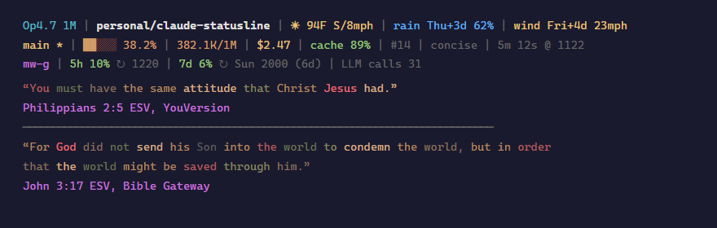

# claude-statusline

A rich PowerShell status bar for [Claude Code](https://docs.anthropic.com/en/docs/claude-code) that displays model info, git state, token usage, cost, subscription quotas, weather, and optionally Bible verses.




## What it shows

**Row 1 — Identity:** model label, working directory, current weather + forecast alerts

**Row 2 — Progress:** git branch/status, context window bar, token count, cost, cache hit %, prompt count, style, API duration

**Row 3 — Quota:** account tag, 5-hour utilization %, 7-day utilization %, LLM call count

**Verses (optional):** Verse of the Day from YouVersion and Bible Gateway (ESV), with word-level color theming

## Features

- **Context pressure bar** — 5-cell block bar colored green → yellow → orange → red as you approach the context limit. Thresholds differ for 200K vs 1M context models.
- **Git integration** — current branch with dirty (`*`), ahead (`+N`), and behind (`-N`) markers.
- **Token accounting** — parses the transcript file to count input + cache_read + cache_creation tokens and compute cache hit %.
- **Prompt counter** — counts real user turns (excluding tool results, meta injections, and slash commands) plus interrupts.
- **Cost tracking** — session cost colored by spend level.
- **Subscription quota** — fetches 5-hour and 7-day utilization from the Anthropic OAuth endpoint (5-min cache, file-locked refresh).
- **Weather** — current conditions + upcoming rain/wind alerts via [Open-Meteo](https://open-meteo.com) (free, no API key). 30-min cache with stale fallback.
- **Bible verses** — dual-source Verse of the Day with word-level coloring in a brown palette (God/Jesus/LORD/Lord highlighted in red). 12-hour cache.

## Setup

1. Copy `statusline.ps1` somewhere permanent (e.g., `~/.claude/statusline.ps1`).

2. Edit the `CONFIG` section at the top of the script:
   ```powershell
   $WEATHER_LAT  = '40.7128'   # your latitude
   $WEATHER_LON  = '-74.0060'  # your longitude

   $ACCOUNT_TAGS = @{
       'yourcompany.com' = 'work'
       'gmail.com'       = 'me'
   }
   ```

3. Configure Claude Code to use the script. In your Claude Code settings (`~/.claude/settings.json`):
   ```json
   {
     "statusline": {
       "command": "powershell -NoProfile -File C:/Users/you/.claude/statusline.ps1"
     }
   }
   ```

4. Restart Claude Code. The status bar appears below your prompt.

## Configuration

| Variable | Purpose | Default |
|----------|---------|---------|
| `$WEATHER_LAT` / `$WEATHER_LON` | Coordinates for weather. Leave empty to disable. | `''` (disabled) |
| `$ACCOUNT_TAGS` | Map email domain suffixes → short labels | `@{}` (shows username portion) |

To disable Bible verses, delete or comment out everything from the `Get-CachedVerse` function definition to the end of the file.

## How it works

Claude Code pipes a JSON blob to the statusline command's stdin on every render. The JSON includes model info, workspace path, transcript path, cost data, and permission mode. This script reads that JSON, enriches it with git status, token parsing, weather, and quota data, then outputs ANSI-colored lines to stdout.

Caches are stored in `~/.claude/`:
- `weather-cache.json` — 30-min TTL
- `usage-exact.json` — 5-min TTL (file-locked to prevent concurrent refreshes)
- `verse-cache.json` / `verse-cache-yv.json` — 12-hour TTL

## Requirements

- Windows with PowerShell 5.1+ (ships with Windows 10/11)
- Claude Code CLI or desktop app
- Git (for branch/status display)
- Internet access (for weather and verse fetching; gracefully falls back to cache)

## License

MIT
