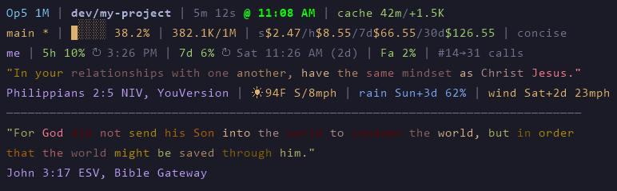

# claude-statusline

A rich PowerShell status bar for [Claude Code](https://docs.anthropic.com/en/docs/claude-code) that displays model info, git state, token usage, multi-window cost, subscription quotas, weather, and optionally Bible verses.




## What it shows

**Row 1 — Identity:** model label, working directory, session duration + last-activity stamp, [prompt-cache countdown](#prompt-cache-countdown)

**Row 2 — Progress:** git branch/status, context window bar, token count, cost (single or four-window), style

**Row 3 — Quota:** account tag, 5-hour utilization %, 7-day utilization %, per-model scoped weekly caps (e.g. `Fa N%`, from the usage response's `limits[]` `weekly_scoped` entries), combined prompt→call counter

**Verses (optional):** Verse of the Day from YouVersion (NIV) and Bible Gateway (ESV), with word-level color theming. The **current weather + forecast alerts** ride the first verse's reference line:

```
Isaiah 60:3 NIV, YouVersion | ⛅ 79F E/8mph | wind Tue+11d 20mph
```

> **Translations.** Bible Gateway is requested as ESV. YouVersion serves whatever its
> default is — currently NIV — because the only URL that still works there is the
> unparameterised one: adding `?version=<id>` (`59` = ESV) now returns a bot-protection
> "Client Challenge" page instead of the verse. Each line is labelled with the
> translation it actually carries. If you want ESV only, set `$VERSE_YOUVERSION = $false`
> and keep the Bible Gateway line.

Row 1 stays session state; weather is ambient, so it sits with the other ambient text. If no verse is cached there is no reference line to attach to, and the weather falls back to row 1 automatically.

## Features

- **Context pressure bar** — 5-cell block bar colored green → yellow → orange → red as you approach the context limit. Thresholds differ for 200K vs 1M context models.
- **Git integration** — current branch with dirty (`*`), ahead (`+N`), and behind (`-N`) markers.
- **Token accounting** — parses the transcript file to count input + cache_read + cache_creation tokens, and reports the **new (non-cached) tokens** of the last turn alongside the [prompt-cache countdown](#prompt-cache-countdown). Read [incrementally](#reading-the-transcript-incrementally), so the cost does not grow with session length.
- **Counter** — `#8→255 calls`: prompts you sent, and the API calls they turned into. The gap between the two numbers is the subagent and tool-loop work each turn spawned.
- **Prompt counter** — counts real user turns (excluding tool results, meta injections, and slash commands) plus interrupts.
- **Cost tracking** — a single session figure, or a four-window view of spend across **session / 5h / 7d / 30d**, each colored by spend level. See [How cost tracking works](#how-cost-tracking-works).
- **Subscription quota** — fetches 5-hour and 7-day utilization from the Anthropic OAuth endpoint (5-min cache, file-locked refresh).
- **Prompt-cache countdown** — a per-session timer showing how long before this conversation's cached prompt prefix expires, so an idle session can be re-armed or abandoned deliberately instead of silently costing a full re-cache. See [Prompt-cache countdown](#prompt-cache-countdown).
- **Weather** — current conditions + upcoming rain/wind alerts via [Open-Meteo](https://open-meteo.com) (free, no API key). 12-hour cache, refreshed off the render hot path. Rendered on the verse reference line, falling back to row 1 when no verse is available.
- **Bible verses** — dual-source Verse of the Day with word-level coloring in a brown palette (God/Jesus/LORD/Lord highlighted in red). 12-hour cache.

## Install

1. **Copy `statusline.ps1`** somewhere permanent (e.g. `~/.claude/statusline.ps1`).

2. **Edit the `CONFIG` block** at the top of the script (all optional — see [Configuration](#configuration)):
   ```powershell
   $WEATHER_LAT  = '40.7128'   # your latitude  (empty = no weather)
   $WEATHER_LON  = '-74.0060'  # your longitude

   $PROFILE_TAGS = @{          # matched by CLAUDE_CONFIG_DIR profile folder (wins)
       'work'     = 'wk'       # %USERPROFILE%\.claude-profiles\work
       'personal' = 'me'
   }
   $ACCOUNT_TAGS = @{          # fallback: matched by email domain suffix
       'yourcompany.com' = 'work'
       'gmail.com'       = 'me'
   }

   $COST_WINDOWS       = $true # $false for a single session "$X.XX" figure
   $BILLING_ANCHOR_DAY = 1     # day of month your plan renews (30d window reset)

   $CACHE_TTL_MIN  = 60        # prompt-cache lifetime, minutes (0 disables the chip)
   $CACHE_WARN_MIN = 15        # <= this many left -> yellow
   $CACHE_CRIT_MIN = 6         # <= this many left -> blinking red
   ```

3. **Point Claude Code at it.** In `~/.claude/settings.json`:
   ```json
   {
     "statusLine": {
       "type": "command",
       "command": "powershell -NoProfile -File C:/Users/you/.claude/statusline.ps1",
       "refreshInterval": 60
     }
   }
   ```
   On PowerShell 7+ use `pwsh` instead of `powershell`.

   `refreshInterval` matters: without it Claude Code only re-renders on new activity, so
   anything that changes while a session sits **idle** — the [prompt-cache
   countdown](#prompt-cache-countdown) above all — freezes at whatever it read when you
   stopped typing. At 60 it re-runs once a minute with no prompting.

4. **Restart Claude Code.** The status bar appears below your prompt and refreshes on every render.

## Configuration

All configuration is the `CONFIG` block at the top of the script — no other edits required to get running.

| Variable | Purpose | Default |
|----------|---------|---------|
| `$WEATHER_LAT` / `$WEATHER_LON` | Coordinates for weather. Leave empty to disable. | `''` (disabled) |
| `$PROFILE_TAGS` | Map `CLAUDE_CONFIG_DIR` profile-folder names → short labels. Checked **before** `$ACCOUNT_TAGS`; reliably distinguishes accounts that share an email domain. Use `.claude` for the default config dir. | `@{}` |
| `$ACCOUNT_TAGS` | Fallback: map email-domain suffixes → short labels. Unmatched accounts show the email's username. | `@{}` |
| `$COST_WINDOWS` | `$true` = session/5h/7d/30d windows; `$false` = single session figure. | `$true` |
| `$BILLING_ANCHOR_DAY` | Day of month your plan renews; the 30d window resets at 00:00 local on it (clamped to month length). | `1` |
| `$CACHE_TTL_MIN` | Default prompt-cache lifetime in minutes, used until the transcript reveals the real TTL (which is then detected automatically). `0` hides the countdown chip entirely. | `60` |
| `$CACHE_WARN_MIN` | Minutes remaining at which the chip turns yellow. | `15` |
| `$CACHE_CRIT_MIN` | Minutes remaining at which the chip turns blinking red. | `6` |

## Prompt-cache countdown

Claude Code caches your conversation's prompt prefix with a **1-hour TTL**, and every
main-chain API call refreshes it. While the cache is warm the prefix re-reads at ~0.1x
the input price; once it lapses, your next turn rewrites the entire prefix at ~2x — call
it a **20x swing**. On a large context that is the difference between cents and dollars,
and it lands invisibly on whichever turn happens to come after the gap.

The chip on row 1 makes that hour visible, per session:

| State | Shows | Meaning |
|-------|-------|---------|
| green | `cache 42m/+1.5K` | Plenty of time. |
| yellow | `cache 12m/+1.5K` | Heads up — wrap up, or plan to re-arm. |
| **blinking red** | `cache 4m/+1.5K` | Act now. Sending *anything* refreshes the cache. |
| filled block | `cache DEAD 12m/+1.5K` | Too late; counts **up** since expiry. Resuming here pays a full re-cache, so this is the moment to decide between paying it and starting fresh. |

A `(5m)` on the label — `cache(5m) 4m/+1.5K` — means the API shortened this session's
cache and the countdown is tracking the shorter life. See
[The TTL is detected, not assumed](#prompt-cache-countdown) below.

The chip carries **two independent signals**. The minutes are how long the cache still
*lives*. The trailing `+N` is how many **new, non-cached tokens** the last turn had to pay
premium for (uncached input plus cache writes) — the number that actually moves your bill,
since a cache write bills at ~2x base input while a read is ~0.1x. It is green under 10K,
yellow to 50K, red beyond; only the `/` is dim. Either half can be absent — setting
`$CACHE_TTL_MIN = 0` leaves a bare `cache +1.5K`.

> **Why not a cache-hit percentage?** Because it carries almost no information. Dividing
> cache reads by total input is pinned near 100% in any warm session: measured across 864
> real turns, 24% rendered as exactly `100%` and ~85% fell in the 97–100% band, because
> median cache-read is ~128K tokens against ~1.5K of new data. It was correct and useless.
> The raw new-token count varies over three orders of magnitude and answers the question
> you actually have: *how much did this turn add?*

Blink is reserved for the only window where blinking is actionable — once the cache is
gone there is nothing left to save, so the expired state is a solid block instead. It
counts up because "just lost it" and "gone for three hours" are different decisions.

Two details that make it trustworthy:

- **It is per session.** The countdown is anchored to *this* session's transcript, so
  running ten sessions at once never moves another one's clock.
- **Subagents don't reset it.** A subagent runs its own prompt with its own prefix, so
  its API calls do **not** refresh the main conversation's cache. Anchoring to file
  modification time would report "fresh" throughout a long subagent run — exactly while
  the cache you care about was expiring. The clock reads the last *main-chain* API call's
  timestamp out of the transcript instead, falling back to mtime only if that is missing.

**Requires `refreshInterval`** in your `statusLine` settings (see [Install](#install)) —
without it, Claude Code only re-renders the status bar on new activity, so the countdown
would freeze at whatever it read when you stopped typing.

**The TTL is detected, not assumed.** Anthropic shortens the cache to a 5-minute TTL when
an account drops into usage overage. The transcript reports which bucket was actually
used — `usage.cache_creation` splits into `ephemeral_1h_input_tokens` and
`ephemeral_5m_input_tokens` — so the countdown reads the real TTL off the last turn that
wrote cache, and the warn/critical bands scale with it (a fixed 15-minute warning could
never fire inside a 5-minute life). `$CACHE_TTL_MIN` is the default when nothing has been
written yet, and remains the manual override.

When the detected TTL differs from your configured default, the chip **says so** —
`cache(5m) 4m/+549`, or `cache(5m) DEAD 16m /+549` once it has lapsed. A normal session
shows a bare `cache 42m`. Without that tag the downgrade is invisible and a correct
reading looks like a broken one: a session idle only 18 minutes renders `cache DEAD 13m`,
which is right on a 5-minute TTL and impossible on a 60-minute one. The switch happens
silently, mid-session, and is announced nowhere else — one observed case ran 384
consecutive cache writes on the 1-hour bucket and then moved to the 5-minute bucket two
minutes later, with no change of model and no notice in the transcript.

## Customize

Everything below the `CONFIG` block is plain PowerShell — tweak freely:

- **Disable Bible verses** — delete or comment out everything from the `# Verse of the Day` comment to the end of the file.
- **Cost color thresholds** — edit the `$cS/$cH/$c7/$c30` lines in the cost block (e.g. `if ($fiveHourTotal -ge 20) { $red } ...`). The single-figure mode uses `$costColor`.
- **Context-bar thresholds / width** — `$barLen` sets the cell count; the `$barColor` block sets the green/yellow/orange/red breakpoints (separate ladders for 200K vs 1M models).
- **Weather alert sensitivity** — the `rain $prob -ge 50` and `wind $maxMph -ge 20` checks in the weather block.
- **Row layout** — segments are appended to `$row1`, `$row2`, `$row3`, and `$partsBottom`; reorder or drop `+=` lines to taste.

## How cost tracking works

Claude Code reports `cost.total_cost_usd` to the statusline. Two things about that number are easy to get wrong, and the four-window view (`$COST_WINDOWS = $true`) handles both:

**1. The `s` figure is this session's cost.** `total_cost_usd` is what the current session has spent, and the **`s` (session)** column shows it directly. (Depending on your Claude Code version it may persist across `/clear`/`/compact`/resume or reset with the new `session_id` — either way it's a sensible "this session" number.)

**2. The wider windows need real time accounting, not cumulative snapshots.** A naive tracker writes each terminal's *cumulative* cost to a file and sums the files inside each window — but the file is stamped at the last render (≈ now), so a terminal you keep open dumps its whole running total into *every* window at once, collapsing `5h = 7d = 30d`. Instead, each session keeps a small **time series** of `<epoch> <cumulative>` samples (one per ~10 min, pruned past 32 days), and a window's spend is:

```
window spend = (cumulative now) − (cumulative at the window's start)
```

summed across sessions. That's accurate no matter how long a session stays open, and the windows actually diverge. A session that began *inside* a window uses its first sample as the baseline; a finished session still contributes whatever it spent before it stopped.

**Keying.** Series files live in `~/.claude/cost-tracker/`, one per session, named `sess-<session_id>.series` (files pool across accounts). Because `total_cost_usd` is per-session, one curve per session means summing the files gives the real cross-session total with no double counting — and the key is read straight from the render JSON, so there's no process-tree walk to do.

**Window boundaries:** the 5h and 7d windows snap to the real `resets_at` reported by the OAuth usage cache (`usage-exact.json`), advanced forward by whole blocks to the most recent boundary at/before now (so a stale anchor still yields the *current* window). The 30d window resets at 00:00 local on `$BILLING_ANCHOR_DAY`.

**Forward-only.** A window can only count spend recorded since its first sample, so on a fresh install (or after clearing the tracker) the windows start near $0 and fill in — the 5h becomes a true rolling 5h after ~5h of uptime, the 30d over the month. Past spend isn't reconstructed (Claude Code transcripts don't store per-message cost); for historical totals, see your Anthropic usage/billing console.

> To reset the windows, just delete the series files: `Remove-Item "$env:USERPROFILE\.claude\cost-tracker\*.series"`. They rebuild from the next render onward.

## Multi-account support

If you run more than one Claude account (e.g. separate Pro/Max subscriptions) and switch between them with per-account [`CLAUDE_CONFIG_DIR`](https://docs.anthropic.com/en/docs/claude-code/settings) profiles, the status bar follows the **active** account automatically — the account tag and the 5h/7d quota reflect whichever account the current session is running, not whichever login happens to be in the default `~/.claude`.

It works because Claude Code spawns the statusline with the session's environment, so the `-NoProfile` script still inherits `CLAUDE_CONFIG_DIR` and reads that profile's credentials + usage cache. With no `CLAUDE_CONFIG_DIR` set (a normal single-account setup) it falls back to `~/.claude` and behaves exactly as before — nothing to configure.

A minimal profile switcher to pair with it (PowerShell):

```powershell
# Each profile keeps its own persisted login; sign in once per profile, then switch freely.
function claude-work { $env:CLAUDE_CONFIG_DIR = "$env:USERPROFILE\.claude-profiles\work"; claude }
function claude-me   { $env:CLAUDE_CONFIG_DIR = "$env:USERPROFILE\.claude-profiles\me";   claude }
```

Add each profile-folder name to `$PROFILE_TAGS` (e.g. `'work' = 'wk'`) so its tag shows in the bar. This is matched ahead of `$ACCOUNT_TAGS` and works even when several accounts share an email domain (e.g. multiple `gmail.com` logins), which a domain-only match can't distinguish.

**One deliberate asymmetry to know about:** the account tag and the 5h/7d quota are *per active account*, but the **cost windows are not**. The cost-tracker lives in canonical `~/.claude/cost-tracker` (keyed by session, with no account in the filename), so the `s`/5h/7d/30d figures **pool across all accounts** and show your **total** spend regardless of which account each session ran under. That's intentional — it's a single grand total, not a per-account meter, so it won't line up with any one account's invoice. If you'd rather track cost per-account, point the tracker dir at `$cfgDir` (the active `CLAUDE_CONFIG_DIR`) instead of `~/.claude` in the script.

## How it works

Claude Code pipes a JSON blob to the statusline command's stdin on every render. The JSON includes model info, workspace path, transcript path, cost data, and permission mode. This script reads that JSON, enriches it with git status, token parsing, cost windows, weather, and quota data, then outputs ANSI-colored lines to stdout.

Caches and state are stored under `~/.claude/`:
- `cost-tracker/sess-<session_id>.series` — a small cost time series per session; differenced for the 5h/7d/30d windows (see [How cost tracking works](#how-cost-tracking-works))
- `cost-tracker/windows.cache` — the on-disk part of the 5h/7d/30d sums, shared by every open session, 60-second TTL. Without it, N sessions each re-sum the same series files to the same answer once a minute.
- `transcript-cache/tx-<session_id>.state` — one line of carried state so the transcript is read **incrementally** (see below). Pruned after 3 days.
- `weather-cache.json` — 12-hour TTL
- `usage-exact.json` — 5-min TTL, file-locked (stored under the active `CLAUDE_CONFIG_DIR` profile when set, so quota is per-account — see [Multi-account support](#multi-account-support))
- `verse-cache.json` / `verse-cache-yv.json` — 12-hour TTL

Every network-backed item is served from cache on the render path and refreshed by a
detached background pass, so a render never blocks on the network. A fetcher that *cannot*
succeed backs off exponentially (5m, 10m, 20m … capped at 6h) instead of being retried
every 45 seconds forever.

### Reading the transcript incrementally

The transcript is append-only and grows for as long as a session lives, so reading it
whole on every render is the one cost that gets *worse* the longer you work — and it is
paid by every open session, once a minute, forever. Everything the statusline takes from
it is either a running total (prompts, API calls) or a last-wins value (token bar, cache
anchor, TTL kind), and both survive being carried forward. So each render stores those
values next to a **byte offset** and the next one parses only the bytes appended since.

Measured under Windows PowerShell 5.1, timing just that section: **163 ms → 20 ms** on a
15.6 MB / 7,395-line transcript, and **196 ms → 20 ms** on a 35.6 MB one. The point is not
the ratio but that the cost is now flat — it no longer grows with the session.

If the stored offset is past the end of the file, or the byte before it is no longer the
newline that ended the last record, the file has been truncated or rewritten and the pass
falls back to a full rescan. Bytes after the last newline are left alone, since that is a
record Claude Code is still writing.

## Requirements

- Windows with PowerShell 5.1+ (ships with Windows 10/11); PowerShell 7+ works too
- Claude Code CLI or desktop app
- Git (for branch/status display)
- Internet access (for weather and verse fetching; gracefully falls back to cache)

## License

MIT
